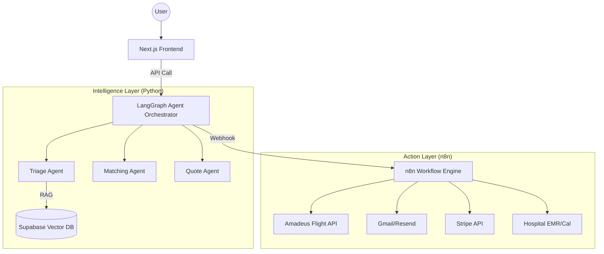

# Directive: Workflow Orchestration (LangGraph + n8n)

## **Goal**
Define the architecture for the "Deep Tech" agent system. We move beyond stateless "Chatbots" to stateful **Orchestration Agents** that manage the entire patient lifecycle.

## **Architecture: The Hybrid Model**

We use **LangGraph** (Intelligence) + **n8n** (Action).

## **1. LangGraph (The Brain)**
**Why?** We need "Memory" and "State". If a patient pauses for 3 days, the agent picks up exactly where they left off.

*   **Location**: `agents/src/graph/`
*   **Key Components**:
    *   **State**: A typed dictionary holding `patient_data`, `documents`, `quote_status`.
    *   **Nodes**: Python functions for `triage_patient`, `rank_hospitals`, `verify_insurance`.
    *   **Edges**: Logic like `if urgency == 'HIGH' -> goto human_handoff else goto auto_match`.
    *   **Checkpointer**: Save state to Postgres so workflows persist across server restarts.

## **2. n8n (The Hands)**
**Why?** Don't write 50 different API clients in Python. Use n8n for standardized connectivity.

*   **Role**:
    *   **Orchestrator**: Triggered by LangGraph via Webhook.
    *   **Task Runner**: "Send WhatsApp", "Check Flight Price", "Create Stripe Invoice".
*   **Integration**:
    *   LangGraph sends JSON payload: `{ action: "send_quote", user_id: "123", quote_url: "..." }`
    *   n8n executes the logic and returns `success` or `failure`.

## **3. Rules of Engagement**

### **Rule A: Separation of Concerns**
*   **LangGraph**: Decisions, Reasoning, Text Generation, Medical Analysis.
*   **n8n**: API calls (Twilio, SendGrid, Stripe), Scheduling, boring logic.
*   **Next.js**: UI, Auth, triggers the initial request.

### **Rule B: Human-in-the-Loop**
*   Deep Tech != No Humans.
*   Critical steps (e.g., "Finalizing Medical Quote") **MUST** have a `human_approval` node in LangGraph.
*   The agent pauses, sends a Slack/Dashboard notification to staff, and waits for API signal to resume.

### **Rule C: Stubbing for MVP**
*   If n8n is not set up locally, mock the Webhook calls in Python.
*   Return dummy success responses so the LangGraph flow can be tested end-to-end.

## **Workflow Example: The "Quote Run"**
1.  **Next.js** sends `POST /api/intake` -> calls LangGraph `start_intake`.
2.  **LangGraph** `TriageNode` analyses symptoms (RAG).
3.  **LangGraph** `MatchNode` selects top 3 clinics.
4.  **LangGraph** calls n8n webhook `check_availability`.
5.  **n8n** queries Hospital mock APIs -> returns slots.
6.  **LangGraph** calls n8n webhook `generate_pdf_quote`.
7.  **n8n** generates PDF -> emails to user.
8.  **LangGraph** updates state to `WAITING_FOR_DEPOSIT`.
