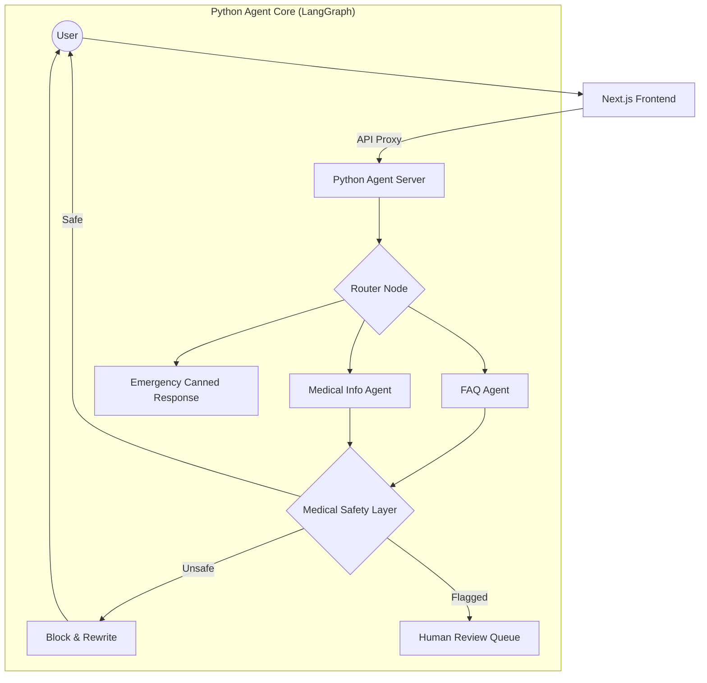

# Directive: Agentic Orchestration (LangGraph + Medical Safety)

## **Goal**
Establish a production-grade, FDA-compliant agent architecture. We move beyond simple "Chatbots" to **Self-Healing, Regulated Agents** that orchestrate the patient journey safely.

## **Architecture: The "Deep Tech" Model**

We use **LangGraph** (Orchestration) + **Medical Safety Layer** (Compliance) + **OpenAI** (Intelligence).

```mermaid
graph TD
    User((User)) --> NextJS[Next.js Frontend]
    NextJS -- API Proxy --> FastAPI[Python Agent Server]
    
    subgraph "Python Agent Core (LangGraph)"
        FastAPI --> Router{Router Node}
        Router --> FAQ[FAQ Agent]
        Router --> MedInfo[Medical Info Agent]
        Router --> Emergency[Emergency Canned Response]
        
        FAQ --> Safety{Medical Safety Layer}
        MedInfo --> Safety
        
        Safety -- Safe --> User
        Safety -- Unsafe --> Blocker[Block & Rewrite]
        Safety -- Flagged --> Audit[Human Review Queue]
        Blocker --> User
    end
```

## **1. Core Component: Medical Safety Layer**
**Why?** LLMs hallucinate. In medicine, hallucinations cause lawsuits or harm. We do **NOT** trust the LLM to police itself.

*   **Location**: `agents/app/core/medical_safety.py`
*   **Mechanism**: Deterministic REGEX & keyword matching (0% hallucination rate).
*   **Rules**:
    1.  **NO Diagnosis**: "You have X" -> BLOCKED.
    2.  **NO Prescriptions**: "Take 5mg of..." -> BLOCKED.
    3.  **NO Unverified Pricing**: "$5,000" -> FLAGGED for human review against DB.
    4.  **NO Accreditation Lies**: "JCI Accredited" -> FLAGGED for verification.

## **2. LangGraph Structure**
**Why?** Stateful management of the conversation and journey.

*   **File**: `agents/app/core/graph.py`
*   **Provider**: OpenAI (`gpt-4o-mini`) is the default for reliability.
*   **Routing**:
    *   **Emergency**: Suicidal/Heart Attack queries bypassed to static help text immediately.
    *   **Human Handoff**: "I want to talk to a person" -> Routes to Coordinator.
    *   **Medical Info**: "What is Lasik?" -> RAG/LLM -> **Safety Layer**.

## **3. Integration with Next.js**
**Why?** The frontend needs to talk to the secure Python environment.

*   **API Route**: `app/api/rag/chat/route.ts`
*   **Pattern**:
    *   Frontend receives user message.
    *   Proxies request to `http://localhost:8000/api/chat`.
    *   **Fallback**: If Python server is offline, frontend falls back to a limited OpenAI direct call (WARN: No safety layer in fallback).

## **4. Rules of Engagement**

### **Rule A: Safety First**
*   If the **Safety Layer** flags a response as `BLOCK`, the user NEVER sees the original LLM output. They see a pre-written "I cannot answer that" message.
*   We prioritize **False Positives** (blocking safe things) over **False Negatives** (allowing unsafe things).

### **Rule B: Deterministic Fallbacks**
*   Emergency queries ("Help me", "Chest pain") must **NEVER** touch the LLM. They must be caught by string matching and return hard-coded emergency numbers (119/911).

### **Rule C: Audit Trails**
*   All `FLAGGED` responses are logged to the `review_queue` table (Supabase) for human review. This is required for future FDA/medical certification.

## **Workflow Example: The "Safe Inquiry"**
1.  **User**: "I have a headache, is it a tumor?"
2.  **Router**: Detects "headache" -> Routes to `MedicalInfoAgent`.
3.  **Agent**: Generates "Headaches can be tumors if..." (Hallucination risk).
4.  **Safety Layer**: Detects "tumor" + diagnosis context. **BLOCKS**.
5.  **Output**: "I cannot diagnose medical conditions. Please consult a doctor."
6.  **Log**: Event saved to `review_queue` for audit.
